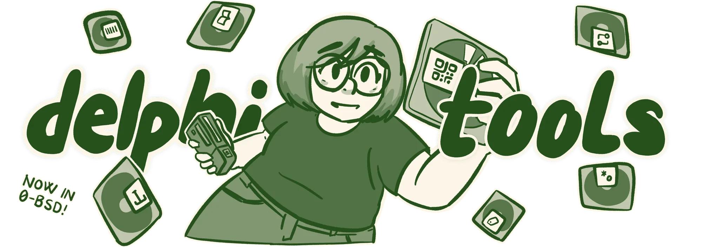

<h1 align="center">delphitools</h1>
<p align="center">the open source toolkit for digital creatives</p>

# Overview

delphitools is a collection of over 80 simple, local-only tools that run in your browser and all solve a problem that I, delphi, have personally had. It is implemented in [Ember.js](https://github.com/emberjs/ember.js) and [Crayon CSS](https://github.com/TeriyakiBomb/crayon) for styling.

All tools are completely open source and transparent. They are componentised and modular, and more tools are added on a regular basis.

delphitools is developed under the Zero-Clause BSD license and as such, is freely available for modification and distribution. If you are missing anything, please feel free to submit an issue or pull request.

If you're on a different platform, try the [delphitools CLI](https://github.com/1612elphi/delphitools-cli), written in Rust, or the iOS version.

# Rationale

delphitools exists as an answer to online tools that all do one thing, and not particularly well at that. It requires no logins, no paywalls, has no hidden features, no premium service, no social features, runs entirely in the browser and doesn't even require an internet connection to function.

# Installation

For local installation, please clone the repository to a destination of your choosing and run the following commands to start a local, Vite-based development server.

```bash
bun install
bun start
```

# Included Tools

## Audio & Video (16)

- Audio Atlas
- Audio Extractor
- Audio Normaliser
- Audio Trimmer
- Auto Subtitle
- Frame Extractor
- Screen Recorder
- Subtitle Converter
- Subtitle Studio
- Timecode Calculator
- Video Atlas
- Video Muter
- Video to GIF
- Video Trimmer
- Voice Recorder
- Waveform Generator

## Calculators (7)

- Algebra Calculator
- Base Converter
- Encoding Tools
- Graph Calculator
- Scientific Calculator
- Time Calculator
- Unit Converter

## Colour (11)

- Colour Atlas
- Colour Blindness Simulator
- Colour Converter
- Contrast Checker
- Gradient Generator
- Harmony Generator
- Palette Collection
- Palette Extractor
- Palette Generator
- Pixel Picker
- Tailwind Shade Generator

## Dev Tools (9)

- Cron Builder
- HTTP Status
- JSON Formatter
- JWT Decoder
- Meta Tag Generator
- Regex Tester
- Request Builder
- Tailwind Cheat Sheet
- UUID Generator

## Images & Assets (16)

- Artwork Enhancer
- Background Remover
- Base64 Image Encoder
- Favicon Generator
- Image Clipper
- Image Compressor
- Image Converter
- Image De-skewer
- Image Splitter
- Image Stitcher
- Image Tracer
- Metadata Stripper
- Paste Image
- Placeholder Generator
- Substrata
- SVG Optimiser

## Other Tools (5)

- Barcode Generator
- Cipher Decoder
- Password Generator
- QR Generator
- Text Scratchpad

## PDF (6)

- Images to PDF
- PDF Compressor
- PDF Organiser
- PDF Page Numbers
- PDF Preflight
- PDF Rotate & Crop

## Print & Production (2)

- Print Imposer
- Zine Imposer

## Social Media (4)

- Matte Generator
- Seamless Scroll Generator
- Social Media Cropper
- Watermarker

## Turbo-nerd Shit (5)

- Braille Converter
- IPA Transcription
- Morse Code
- NATO Phonetic
- Shavian Transliterator

## Typography & Text (11)

- Document Converter
- Font File Explorer
- Glyph Browser
- Large Type
- Line Height Calculator
- Paper Sizes
- PX to REM
- Text Diff
- Text Editor
- Typography Calculator
- Word Counter
